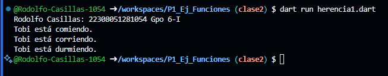

Crear una clase animal con los atributos (Id_animal, nombre y raza) y una funcion comer(). Crear otra clase perro con herencia animal con las funciones correr() y otra dormir(). Lenguaje dart

Salida de resultados 

