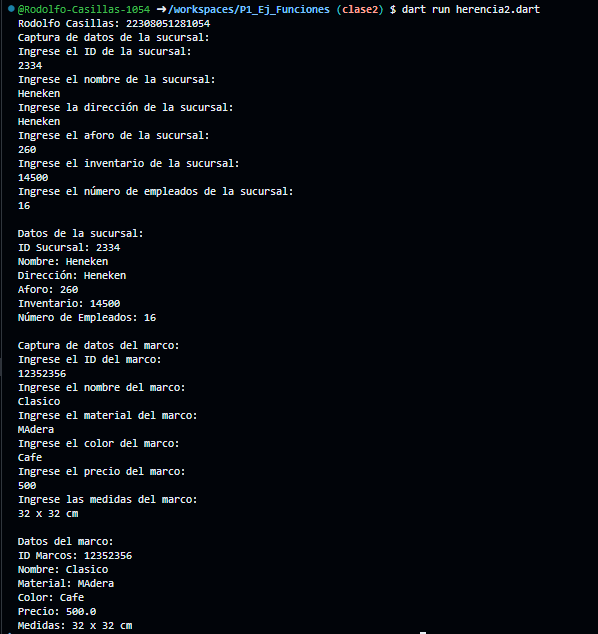

Crear una clase Sucursal con los atributos (Id_Sucursal, Nombre, Direccion, Aforo, Inventario y numero_empleados) Con una función capturadatos(), con interacción de interfaz de usuario. Crear clase DatosSucursal con herencia Sucursal y una funcion mostrardatos() y  Marcos con los atributos (Id_Marcos, Nombre, Material, Color, Precio y Medidas) Con una función captuadatos(), con interacción de interfaz de usuario. Crear clase DatosMarcos con herencia Marcos y una funcion mostrardatos(). Lenguaje Dart

Salida de datos

