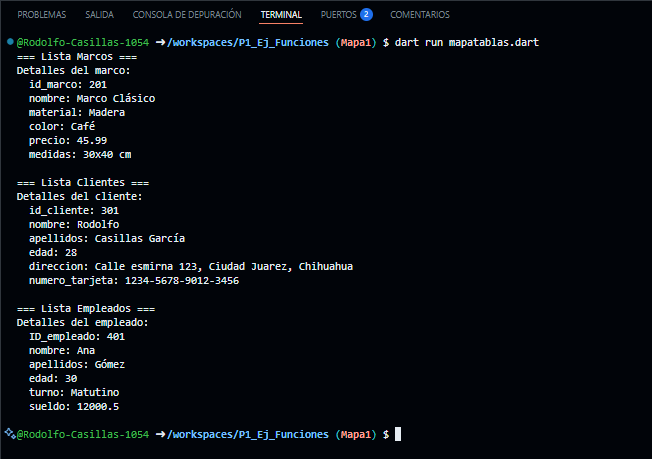

crear map <String, dinamic> tienda de marcos con los siguientes key, id_marco, nombre, material, color, precio y medidas para los marcos, id_cliente, nombre, apellidos, edad, direccion y numero de trajeta para los clientes y ID_empleados, nombre, apellidos, edad, turno y sueldo para los empleados. Mostrar los datos con un forEach. Lenguaje dart

Salida de Datos

